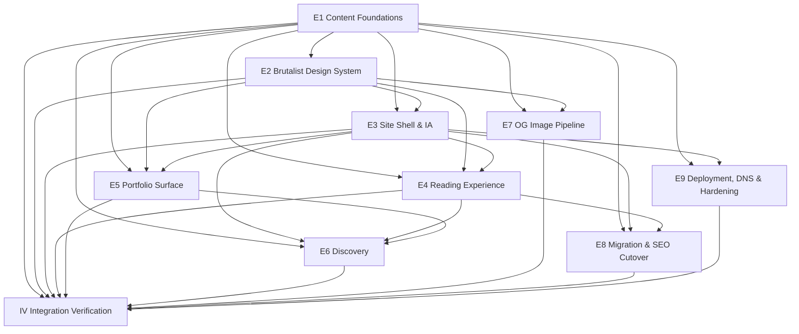

# Decomposition Synthesis — ryanhenderson.dev

Synthesised from the 6-angle convoy:
1. Bounded-context mapper · 2. Dependency analyst · 3. Scope sizer · 4. Interface designer · 5. STPA control-structure analyst · 6. Structural-semantic gap analyst.

All six converge on a **10 domain epics + 1 Integration Verification (IV)** structure. Strong agreement on contexts, ordering, and the foundational seams. Disagreements (split deploy from DNS, split migration into content-port + SEO-cutover, drop scripted DNS) are flagged inline; user already chose to keep scripted DNS, so this synthesis honours that choice.

---

## Epic structure (proposed)

| # | Epic | Bounded context | EARS subset |
|---|---|---|---|
| **E1** | **Content Foundations** | Project scaffold + collection schemas + the `getPublishedPosts/Projects` helper that defines "publishable" | U-1, U-2, U-3, E-1, E-2, O-1 |
| **E2** | **Brutalist Design System** | Tokens (CSS + TS) + light/dark theme + FOUC-proof inline script + theme toggle | U-14, U-15, U-16, U-17, W-1, W-2 |
| **E3** | **Site Shell & IA** | BaseLayout, Header, Footer, Home, About, 404 — the chrome that wraps every route | U-20, U-25, partial U-18/U-19 |
| **E4** | **Reading Experience** | Post route + MDX components + Shiki + prose typography + reading-time/word-count | U-4, U-5, U-6, O-1 |
| **E5** | **Portfolio Surface** | `/work/` index + project detail + status badge + conditional repo link | U-7, U-8, E-3 |
| **E6** | **Discovery: feeds, tags, sitemap, search** | All build-time enumeration artifacts that consume the published-content set | U-9, U-10, U-11, U-12, U-27, U-28 |
| **E7** | **OG Image Pipeline** | Satori-rendered 1200×630 cards + per-page social meta tags | U-13 |
| **E8** | **Migration & SEO Cutover** | Port `hello-blog`/draft/about, audit inbound links, `_redirects`, single retirement commit | U-24, U-25, U-26 |
| **E9** | **Deployment, DNS & Hardening** | CF Pages project + scoped-token DNS provision script + `_headers` (CSP + preview noindex) + CF Web Analytics + frozen-lockfile hygiene | U-21, U-22, U-23, E-4, E-5 |
| **IV** | **Integration Verification (MEDIUM)** | End-to-end scenarios + Lighthouse-CI + a11y smoke + RSS/sitemap validation + HTML budget | U-18, U-19, S-1..S-15 |

### Why these splits

- **E1 keeps schemas + helpers together** (gap analyst: false-separation risk #1). The schema *defines what a post is*; the helper *defines which posts count*. Split them and drafts leak.
- **E2 owns the theme switcher script** (gap analyst tension #3). It's structurally chrome but semantically a runtime expression of the token system; the FOUC-of-color failure mode is a design bug.
- **E2 + E7 share the token module** (gap analyst tension #2 / "false neighbour"). Tokens.ts is the single source consumed by CSS, Shiki (`cssVariables` mode), AND Satori. E7 imports E2's `tokens` object directly.
- **E6 unions Posts + Projects via tags** (gap analyst tension #4). Tag archive lives in Discovery, not in either content-specific epic.
- **E8 is one epic, not two.** Gap analyst proposed splitting Content Port from SEO Cutover. Rejected for this scale: a 2020 post + a draft + an about page is not enough material to justify two epics. ACs require the inbound-link audit step inside E8.
- **E9 keeps Pages config + DNS script + headers together.** Gap analyst recommended splitting; advisory recommended dropping the script entirely. User chose to keep U-22, so it lives here with strict scoped-token AC.
- **E10 is MEDIUM scope** (sizer: behavioural contracts present, composition contracts present, but ≤15 docs and no runtime). One Playwright suite hitting the cross-epic scenarios + the gates.

### Per-epic bloat-risk callouts (from sizer)

- **E6 is the loose-fit epic.** Pagefind + 5 build-time emitters + tag archives. If it slips, defer the ⌘K overlay (was already deferred at Gate 2 — see below).
- **E9 is the second loose-fit epic.** Scripted DNS is the hot piece. If it slips, demote to dashboard runbook (the advisory's recommendation that the user declined).
- **E7 (OG) is the deferrable epic.** Spec keeps it in v1; if loop time runs short, ship static fallback + meta tags only and move Satori to v1.5.

---

## Dependency graph

**Critical path:** E1 → E2 → E3 → E4 → E6 → E8 → E9 → IV (8 hops). Slipping E1 cascades into 9 downstream epics.

**Parallelisable seams** (could be cooked in parallel sessions if desired):
- E4 ∥ E5 (both sit on E3; emit different routes; share zero logic)
- E6 ∥ E7 (both consume `getPublishedPosts`; emit to disjoint paths)
- E8 ∥ E9 (Migration cutover and Deploy infra are coordinated only at the final cutover commit)

---

## Processing order (for the loop)

1. **E1 — Content Foundations** *(load-bearing; do this right)*
2. **E2 — Brutalist Design System**
3. **E3 — Site Shell & IA**
4. **E4 — Reading Experience**
5. **E5 — Portfolio Surface**
6. **E6 — Discovery**
7. **E7 — OG Image Pipeline** *(deliberately late — most complex, most deferrable)*
8. **E8 — Migration & SEO Cutover**
9. **E9 — Deployment, DNS & Hardening**
10. **IV — Integration Verification** *(terminal)*

---

## Cross-cutting concerns (folded into per-epic acceptance criteria, not separate epics)

These came out of the STPA + advisory analyses. Each domain epic must satisfy the relevant rows below.

| Concern | From | Lives in epic | Acceptance criterion |
|---|---|---|---|
| **Single `getPublishedPosts/Projects` helper is the only filter authority** | STPA B1, advisory P1 #4 | E1 | Lint rule (or convention + grep test) banning direct `getCollection("blog")` outside `src/lib/content.ts`. |
| **Build-time smoke test: no draft slugs in dist/feed.xml or sitemap** | STPA B1, advisory P1 #4 | E6 | Test parses produced artifacts and asserts on slugs. Test fails build. |
| **Theme script runs pre-paint, on every navigation** | STPA B2, U-15 | E2 | Playwright visual regression asserts dark background present at frame 1 in dark-system mode. |
| **`_redirects` ships in the same commit as Jekyll deletion** | STPA B3, advisory P1 #8 | E8 | Audit step + redirect file present in retirement commit; legacy URL test. |
| **Build script IS the deploy gate** | STPA B4 | E9 | `pnpm build` runs zod validation, frozen-lockfile install, RSS validator. CF Pages just invokes `pnpm build`. |
| **Scoped CF API token** | STPA B5, advisory P1 #2 | E9 | Documented in `docs/runbooks/dns.md`: `Zone:DNS:Edit` for the zone only + `Account:Pages:Edit` for the project only. |
| **`pnpm install --frozen-lockfile` + committed lockfile + `pnpm audit` in CI** | advisory P1 #3 | E9 | CF Pages build command and CI workflow both use frozen-lockfile. |
| **Lazy-load Pagefind on first interaction only** | advisory P1 #10, U-28 | E6 | Mobile Lighthouse on a non-search route shows zero pagefind asset bytes. |
| **Time-box token system to 8–12 tokens** | advisory P1 #9 | E2 | Token count check; review trigger if exceeded. |
| **Permissive zod schemas (optional defaults where reasonable)** | advisory P2 #17 | E1 | Schema review during E1 acceptance. |
| **Single Shiki theme via `cssVariables` mode** | advisory P2 #15 | E4 | One Shiki invocation; no second theme bundle. |
| **Baseline CSP with theme-script SHA-256 hash** | advisory P2 #11 | E9 | `_headers` file with CSP; build-time hash check on the inline script. |
| **`X-Robots-Tag: noindex` on non-prod CF Pages branches** | advisory P1 #1, P2 #12 | E9 | `_headers` rule scoped by branch (or CF Access enabled on previews). |
| **Preview builds either exclude drafts or are noindex'd** | advisory P1 #1, STPA B1 | E9 | Decision documented; default = noindex preview branches via `_headers`. |
| **Tokens emit BOTH CSS variables AND TS object (for Satori)** | gap analyst tension #2 | E2 | Single source `src/styles/tokens.ts`; CSS is generated; Satori imports the TS object. |
| **Reading-time + word-count rendered on every post** | U-4 | E4 | Test asserts presence on rendered post HTML. |

---

## Top interface contracts (from the interface designer)

These are the contracts the IV epic verifies. They're stored on each domain epic; this is the consolidated index.

| # | Contract | Producer | Consumer(s) | Type |
|---|---|---|---|---|
| C-1 | Content collection zod schemas | E1 | E4, E5, E6, E7 | Data |
| C-2 | `getPublishedPosts(opts)` / `getPublishedProjects(opts)` signature + sort + draft semantics | E1 | E3, E4, E5, E6, E7 | Behavioural |
| C-3 | Slug uniqueness within collection (cross-collection allowed) | E1 | E3, E4, E5, E6 | Data |
| C-4 | Token export: CSS `:root` variables + TS object + theme-variant convention `[data-theme]` | E2 | E3, E4, E5, E7 | Composition |
| C-5 | Theme inline script: `localStorage["theme"]` key, valid `light`/`dark`, pre-paint application | E2 | E3 | Composition |
| C-6 | BaseLayout composition contract: `<head>` slot, theme-toggle slot, footer slot | E3 | E4, E5, E6, E8 | Composition |
| C-7 | RSS shape: RSS 2.0, last 20 non-draft, full content; separate Atom hand-rolled | E6 | (consumers external) | Data |
| C-8 | Sitemap + robots: `@astrojs/sitemap` defaults; `/robots.txt` references prod sitemap only | E6 | (consumers external) | Data |
| C-9 | Pagefind index location `dist/pagefind/`; lazy import contract on `/search` | E6 | (consumers external) | Behavioural |
| C-10 | OG card naming `/og/<slug>.png`; Satori reads tokens TS module | E7 | (social platforms external) | Composition |
| C-11 | `_redirects` file: legacy paths → new slugs, 301 status | E8 | (CF Pages runtime) | Behavioural |
| C-12 | `_headers` file: baseline CSP with theme-script hash + branch-conditional `X-Robots-Tag` | E9 | (CF Pages runtime) | Composition |
| C-13 | Build command `pnpm install --frozen-lockfile && pnpm build && pnpm pagefind` | E9 | (CF Pages runtime) | Behavioural |
| C-14 | DNS provision script: idempotent, scoped token, exit codes 0/2/3/4 | E9 | (operator runbook) | Behavioural |

**Composition-level contracts present** ⇒ IV scope is **MEDIUM** (per the IV contract-classification tree).

---

## Multi-criteria validation (per epic)

| Epic | Structural ✓ | Semantic ✓ | Organisational ✓ | Economic ✓ | Production-grade slice ✓ |
|---|---|---|---|---|---|
| E1 | Acyclic, foundation | Stable bounded context (publishability) | Single owner | Highest leverage | n/a (foundation) |
| E2 | Acyclic | Coherent (visual identity) | Single owner | Token discipline pays for many epics | n/a |
| E3 | Acyclic | Coherent (chrome) | Single owner | Reused by 5 epics | E3+E4 = first end-to-end production slice |
| E4 | Acyclic | Coherent (reading) | Single owner | High value-per-effort | ✓ (post route is the core product) |
| E5 | Acyclic | Coherent (portfolio) | Single owner | High value-per-effort | ✓ |
| E6 | Acyclic; 5 emitters share helper | Coherent (enumeration of published content) | Single owner | High — single-helper invariant lives here | n/a |
| E7 | Acyclic; isolated build script | Coherent (social card) | Single owner | Lowest-leverage in v1; deliberately late | n/a |
| E8 | Acyclic; cutover | Coherent (transition) | Single owner | High — protects existing SEO | n/a |
| E9 | Acyclic | Coherent (delivery) | Single owner | Required to ship | n/a |
| IV | Acyclic; terminal | Coherent (cross-epic verification) | Single owner | Catches B1–B5 hazards | ✓ (system-level proof) |

All boxes pass.

---

## Fitness functions & re-decomposition triggers

These remain valid for the life of the system; if any breaches, re-decomposition is justified.

| Fitness function | Threshold | Re-decomp trigger |
|---|---|---|
| Lighthouse mobile P/A/BP/SEO on home/post/project | ≥ 95 | Sustained < 90 with no clear single cause |
| First-load HTML | < 50 KB gzipped | Sustained > 75 KB on a static route |
| Build time | < 60 s for ≤ 25 docs | > 3 min — re-evaluate Satori at build time vs Worker |
| Content volume | ≤ ~50 posts in v1 lifecycle | > 100 posts — re-evaluate Pagefind vs server-side search |
| Token count | 8–12 | > 20 — token system is leaking into design decisions |
| RSS draft leak | 0 (smoke test) | Any single occurrence — break the design before fixing the symptom |
| `getCollection` calls outside `src/lib/content.ts` | 0 | Any new direct call — drift in the publishedness contract |

---

## Open advisory items still on the table

These were P1/P2 in the advisory brief and the user kept them as-is. Calling them out so the work-phase doesn't quietly drop them:

- **OG images stay in v1** (advisory said defer; user kept). E7 ships Satori; if the loop hits trouble, fall back to static PNG + meta tags.
- **Atom feed stays in v1** (advisory said drop; user kept). E6 hand-rolls Atom alongside RSS.
- **Scripted DNS stays in v1** (advisory said drop; user kept; user explicitly chose "plan + script everything"). E9 produces `scripts/provision-cf.ts` with a scoped token, and the scoped token AC is non-negotiable.

---

## Summary for Gate 3

- **10 domain epics + 1 IV (MEDIUM)**, processed in the listed order.
- **Critical path** is 8 hops; E1 is the load-bearing seam.
- **Cross-cutting concerns** (16 of them) are folded into per-epic acceptance criteria, not separate epics.
- **14 interface contracts** spanning data-only, behavioural, and composition types — composition contracts justify MEDIUM IV scope.
- **3 advisor-flagged P1 items kept by user choice** (OG, Atom, scripted DNS) — embedded in epic ACs with the relevant security/scoping mitigations.
- **Fitness functions** defined for ongoing assumption monitoring.

Ready for Gate 3 approval.