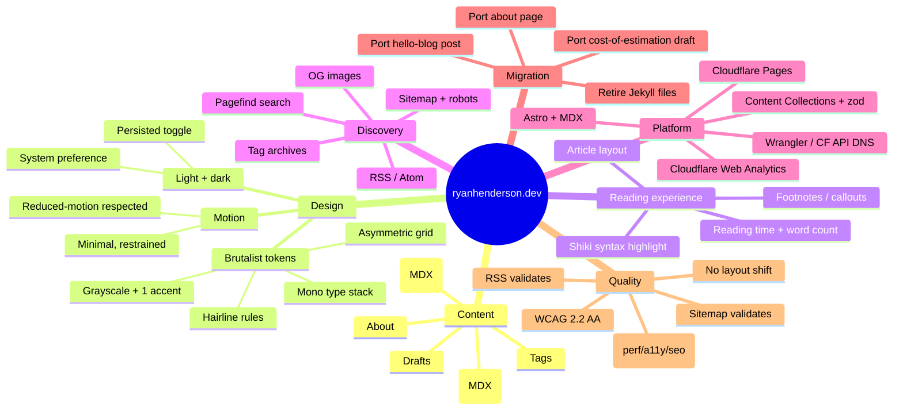
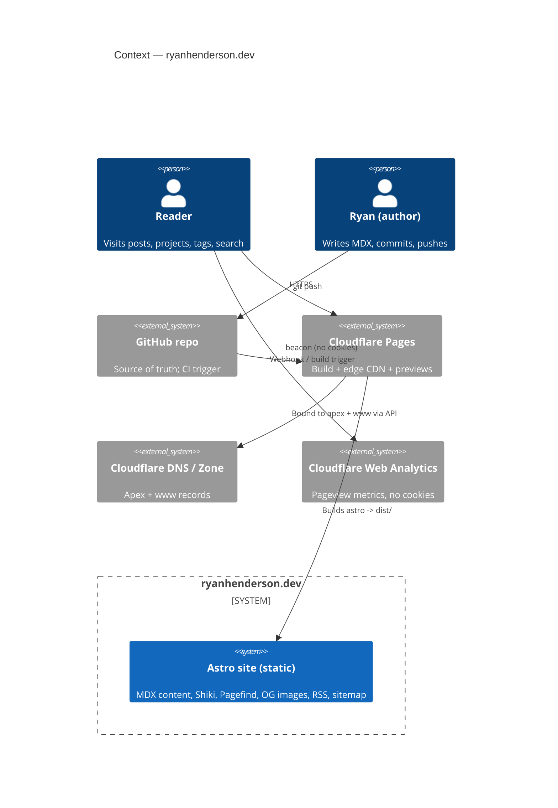
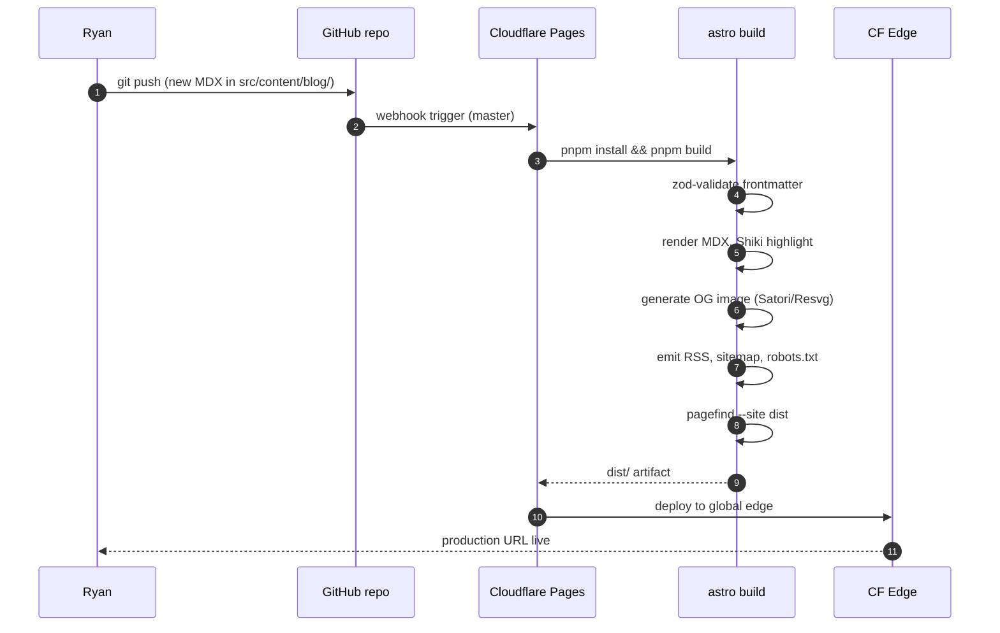
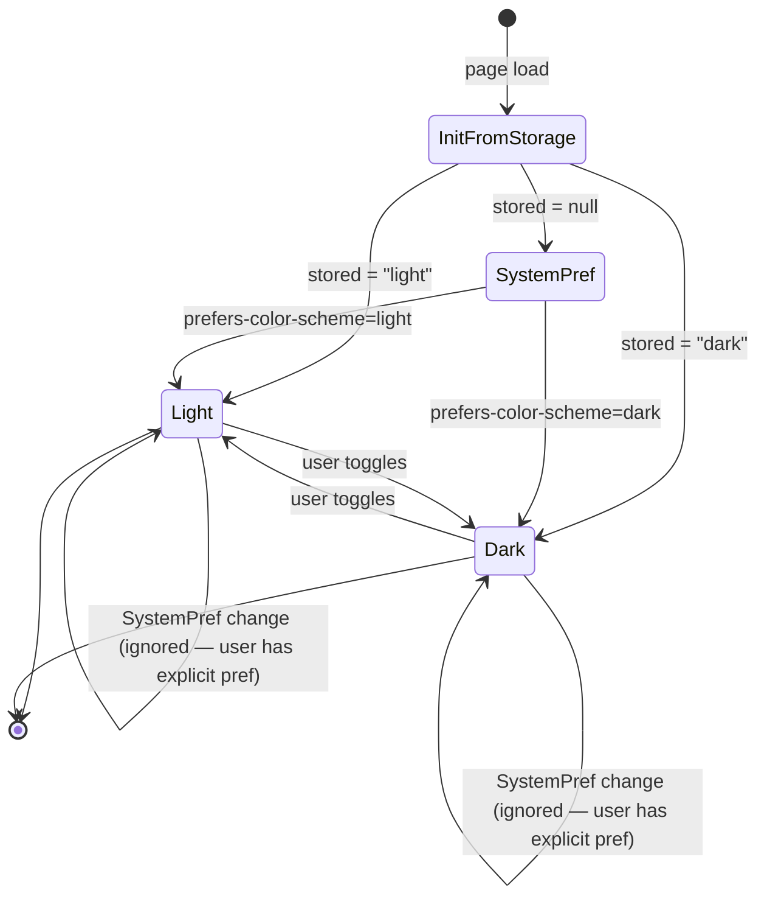
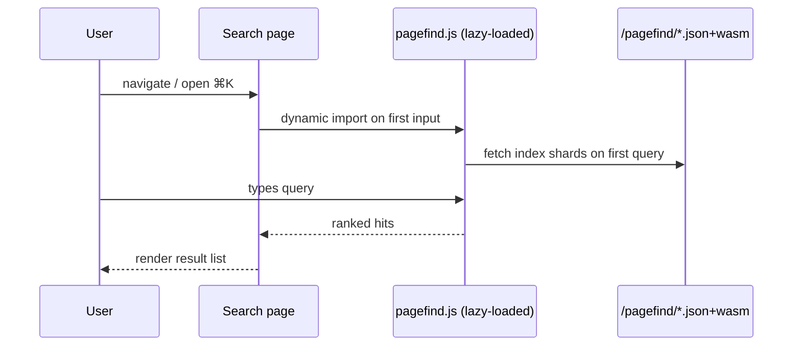

# ryanhenderson.dev — System-Level Specification

> Custom blog + portfolio site replacing the existing Jekyll/GitHub Pages setup.
> Stack: **Astro + MDX**. Hosting: **Cloudflare Pages**. Aesthetic: **Swiss Brutalist / monospace-driven**.

---

## 1. Why this exists

Ryan currently runs a Jekyll blog on the `so-simple` theme on GitHub Pages. He wants to retire it in favor of a hand-built site that:

- Acts as a personal **publication** (long-form software writing) AND a **portfolio** for a small set of solo open-source / SaaS projects he is shipping.
- Has a **distinct, opinionated visual identity** instead of a stock theme — Swiss Brutalist (monospace, exposed structure, raw rules, ink-on-paper or paper-on-ink).
- Is **fast, no-JS-by-default**, accessible, and easy to author in MDX.
- Lives on **Cloudflare Pages** (not Vercel), with everything — including DNS — scriptable via Wrangler / CF API.

This is the irreversible decision boundary the rest of the system flows from.

---

## 2. Domain glossary (ubiquitous language)

| Term | Definition |
|---|---|
| **Post** | A long-form blog entry. MDX. Has `slug`, `title`, `pubDate`, `summary`, `tags[]`, `draft`, optional `updated`. Lives in `src/content/blog/`. |
| **Project** | A portfolio entry for a solo OSS / SaaS thing. Has `slug`, `name`, `oneLiner`, `status` (active/archived/private), `marketingUrl`, optional `repoUrl`, `tags[]`, longer MDX body for case-study content. Lives in `src/content/projects/`. |
| **Page** | A static, non-collection page (about, index, 404, tags, search). |
| **Tag** | A free-form taxonomy label shared by Posts and Projects. Generates an archive page `/tags/<tag>/`. |
| **Theme** | Light or dark color mode. System-preference + user toggle, persisted in `localStorage`. |
| **Brutalist token** | A design token (font, size, rule weight, spacing step) chosen to express the Swiss Brutalist aesthetic. |
| **OG card** | A 1200x630 PNG generated at build time from post/project frontmatter, used for social sharing. |
| **Pagefind index** | Static client-side search index produced after the build, served as JSON+wasm. |
| **CF Pages project** | The deployed unit: a Git-connected (or direct-upload) Cloudflare Pages project bound to `ryanhenderson.dev`. |
| **Build artifact** | Output of `astro build` — `dist/` directory containing static HTML, hashed CSS/JS islands, RSS, sitemap, OG images, search index. |

---

## 3. Discovery mindmap

---

## 4. System-level EARS requirements

EARS patterns: **U**biquitous, **E**vent-driven, **S**tate-driven, un**W**anted, **O**ptional.

### 4.1 Content authoring

- **U-1** The system **shall** treat `src/content/blog/**/*.mdx` as the canonical source for posts.
- **U-2** The system **shall** treat `src/content/projects/**/*.mdx` as the canonical source for portfolio entries.
- **U-3** Each post and project **shall** validate against a zod schema at build time; invalid frontmatter **shall** fail the build with a precise error.
- **E-1** When a post's `draft` field is `true`, the build **shall** exclude it from production output (RSS, sitemap, indexes) but include it in `astro dev`.
- **E-2** When two posts share a `slug`, the build **shall** fail.

### 4.2 Reading experience

- **U-4** Every post page **shall** render: title, pubDate, optional updated date, reading time (200 wpm), word count, tags, MDX body, prev/next links.
- **U-5** Code blocks **shall** be highlighted at build time via Shiki. Light/dark variants **shall** be driven by the `--shiki-*` CSS variable surface (single Shiki invocation, `cssVariables` mode) rather than by bundling two separate themes — see decomposition cross-cutting concern "Single Shiki theme via cssVariables mode" (advisory P2 #15).
- **U-6** Body typography **shall** maintain a measure of 60–75 characters at the article width.
- **O-1** Posts **may** include MDX components: `<Callout>`, `<Figure>`, `<Footnote>`.

### 4.3 Portfolio

- **U-7** Each project **shall** display: name, one-liner, status badge, marketing URL (always), repo URL (if present), tags, body.
- **U-8** The project index `/work/` **shall** list active projects first, archived second, hide projects with `status: private`.
- **E-3** When a project has no `repoUrl`, the UI **shall** render only the marketing link without a broken / placeholder repo button.

### 4.4 Discovery

- **U-9** The build **shall** produce `/feed.xml` (RSS 2.0) and `/atom.xml` containing the latest 20 non-draft posts with full content.
- **U-10** The build **shall** produce `/sitemap-index.xml` and `/robots.txt`.
- **U-11** The build **shall** produce a Pagefind index covering posts and projects.
- **U-12** Tag archive pages **shall** be generated for every tag referenced by at least one non-draft post or non-private project: `/tags/<tag>/`.
- **U-13** Each post and project **shall** have a generated 1200x630 OG image at `/og/<slug>.png`.

### 4.5 Visual system

- **U-14** The site **shall** use a monospaced primary type stack with a serif/sans secondary stack reserved for prose only if needed.
- **U-15** The site **shall** ship **light and dark** color modes; the initial mode **shall** match `prefers-color-scheme`; a toggle **shall** persist user choice in `localStorage` and survive page navigation without flash.
- **U-16** All interactive elements **shall** meet **WCAG 2.2 AA** contrast requirements in both modes.
- **W-1** The site **shall not** ship any client-side JavaScript on routes that have no interactive component (no framework runtime on static pages).
- **W-2** The site **shall not** include third-party trackers other than Cloudflare Web Analytics.
- **U-17** Motion **shall** respect `prefers-reduced-motion: reduce`.

### 4.6 Performance & quality

- **U-18** Production builds **shall** achieve Lighthouse scores ≥ 95 for Performance, Accessibility, Best Practices, and SEO on the home, post, and project routes (mobile profile).
- **U-19** Cumulative Layout Shift **shall** be 0 on home, post, and project routes.
- **U-20** First-load HTML for any route **shall** be < 50 KB gzipped (excluding images).

### 4.7 Hosting & deployment

- **U-21** Production deploys **shall** publish to a Cloudflare Pages project named `ryanhenderson-dev`.
- **U-22** The custom domain `ryanhenderson.dev` (apex) and `www.ryanhenderson.dev` **shall** be provisioned via Wrangler / CF API as part of an idempotent script.
- **E-4** When a commit lands on `master`, CF Pages **shall** build and deploy the site.
- **E-5** When a commit lands on any non-`master` branch, CF Pages **shall** produce a preview deploy.
- **U-23** All secrets (CF API token, account ID, zone ID) **shall** live in `.env.local` (gitignored) and CI/CF environment variables, never in repo.

### 4.8 Migration

- **U-24** The system **shall** preserve the URL `/hello-blog/` (existing Jekyll permalink for the 2020 post) via the same canonical post slug, OR provide a 301 redirect to a new slug if the slug changes.
- **U-25** The about page content from `about.markdown` **shall** be ported to the new system without semantic loss.
- **U-26** When the new site is live and verified, all Jekyll files (`_config.yml`, `Gemfile`, `Gemfile.lock`, `_posts/`, `_drafts/`, `_data/`, `*.markdown`, `404.html`, `index.html`, `categories.html`, `posts.html`, `search.html`, `tags.html`) **shall** be deleted in a single retirement commit.

### 4.9 Search

- **U-27** Site search **shall** be client-side, zero-server, indexed at build via Pagefind.
- **U-28** The search UI **shall** be reachable from the global header via a `/search` page or a `⌘K`-style overlay; v1 chooses one path and ships it.

---

## 5. Architecture

### 5.1 C4 Context

### 5.2 Build sequence (publish a post)

### 5.3 Theme state machine

> Note: theme MUST be applied **before** first paint via an inline script in `<head>` to avoid a flash of incorrect theme (FOIT/FOUT for color).

### 5.4 Search interaction (Pagefind)

---

## 6. Scenario table

| ID | Scenario | Trigger | Expected behavior | EARS ref |
|---|---|---|---|---|
| S-1 | First-time reader hits home | GET / | Brutalist home with index of recent posts + featured projects, no JS unless theme toggle interacted | U-15, W-1 |
| S-2 | Author publishes a draft | mdx with `draft: true` | Excluded from prod build; visible in `astro dev` | E-1 |
| S-3 | Author publishes a real post | mdx with `draft: false`, push to master | CF Pages builds, deploys, RSS updates, sitemap updates, OG image generated | E-4, U-9, U-10, U-13 |
| S-4 | Reader on system dark mode | First visit, no localStorage | Site renders in dark immediately, no flash | U-15, S5.3 |
| S-5 | Reader toggles theme | Click toggle | Theme flips, persists, survives navigation | U-15 |
| S-6 | Reader searches "estimation" | Open search, type | Pagefind returns post + any tagged project | U-11, U-27 |
| S-7 | Reader visits `/hello-blog/` | Direct URL (legacy SEO) | Renders the migrated 2020 post (or 301s to new slug) | U-24 |
| S-8 | Reader hits a tag page | GET /tags/consulting/ | List of all posts + projects tagged `consulting` | U-12 |
| S-9 | Reader on slow 3G | First visit | First contentful paint < 1.5s, no layout shift | U-18, U-19 |
| S-10 | Bot fetches /feed.xml | GET /feed.xml | Valid RSS 2.0 with last 20 posts, full content | U-9 |
| S-11 | New project added | mdx in projects/, no repoUrl | Card shows marketing link only, no broken repo button | U-7, E-3 |
| S-12 | Lighthouse CI run | PR | Scores ≥ 95 across P/A/BP/SEO | U-18 |
| S-13 | Author rotates CF API token | Update CF env | Next deploy works without code change | U-23 |
| S-14 | Reader on `prefers-reduced-motion` | First visit | All non-essential animation disabled | U-17 |
| S-15 | Jekyll retired | Cutover commit | Old `_*` files removed, new site is sole source | U-26 |

---

## 7. Reversibility & change-volatility map

| Decision | Reversibility | Volatility | Investment |
|---|---|---|---|
| Astro + MDX | **Irreversible-ish** (content schema + idioms propagate) | Low | Lock in early, design content schema carefully |
| Cloudflare Pages | Moderate (build artifact is portable; functions / wrangler are not) | Low | Avoid CF-only runtime features in v1 |
| Brutalist aesthetic | Moderate (tokens centralized → palette/typeface swappable; layouts harder) | High (will iterate) | Strict token discipline, no inline styles |
| Content schemas (post, project) | Moderate (migration cost grows with content volume) | Moderate | Add fields conservatively; never repurpose names |
| URL structure (`/posts/<slug>/`, `/work/<slug>/`, `/tags/<tag>/`) | Moderate (SEO cost on change) | Low | Decide once; document |
| Theme toggle UX | Reversible | Moderate | Centralize in one component |
| Pagefind | Reversible (swap to Fuse / Algolia later) | Low | Fine to commit |
| OG image generator | Reversible | Low | Build-time only, no runtime dep |
| GA4 → CF Web Analytics | Reversible | Low | Done at platform layer |

**Implication for decomposition:** Epics that touch *content schemas*, *URL structure*, and *the design token layer* should be sequenced **early** so later epics build on stable contracts. Volatile-but-centralized concerns (aesthetic) get one epic each; ambient concerns (a11y, perf budget) become fitness functions, not epics.

---

## 8. Design profile note

This system is a **user-facing product** where **design quality matters**. Per the architect skill's design-skill detection, applicable epics SHOULD invoke `/compound:build-great-things` during their work phase. The skill covers:

- Software design philosophy (Ousterhout: deep modules, complexity management, information hiding) — applies to the **content/build pipeline** epic and the **design system / tokens** epic.
- The full visual build sequence (IA → typography → color → motion → states → accessibility → conversion) — applies to the **site shell**, **reading experience**, **portfolio surface**, and **home/index** epics.

Reference design research already in repo:
- `docs/compound/research/design/style/swiss-brutalist-design.md` — primary aesthetic anchor
- `docs/compound/research/design/style/swiss-international.md`
- `docs/compound/research/design/web-apps/web-typography-and-reading-ergonomics.md`
- `docs/compound/research/design/web-apps/accessibility-and-inclusive-design.md`
- `docs/compound/research/design/web-apps/color-theory-for-digital-interfaces.md`
- `docs/compound/research/design/web-apps/interaction-design-and-micro-interactions.md`
- `docs/compound/research/design/frontend-design/award-winning-websites-anatomy.md`

---

## 9. Default delivery profile (advisory)

`webapp` (specifically: **static webapp, edge-deployed**). Downstream verification contracts should expect: HTML+CSS+islands, build-time tests + per-route Lighthouse + Playwright a11y smoke, no DB/state.

---

## 10. Assumptions (must hold for this decomposition)

1. Ryan owns `ryanhenderson.dev` in Cloudflare DNS (or is willing to transfer the zone).
2. Cloudflare Pages free tier limits (500 builds/month, no per-build minute cap that we're near) are sufficient.
3. There is no mandate to keep GitHub Pages live during cutover beyond a brief overlap window.
4. Content volume in v1 is small (≤ ~10 posts, ≤ ~5 projects), so client-side search is appropriate.
5. No comments, newsletter, or auth in v1. (Future epics can add.)
6. No legal requirement (GDPR consent banner, etc.) is triggered by Cloudflare Web Analytics in the author's primary audience.

If any of these flip, re-decomposition trigger fires (see fitness functions in Phase 4).

---

## 11. Out of scope (v1)

- Comments / discussions
- Newsletter signup / email
- Authenticated areas
- CMS GUI (authoring is `git push`)
- i18n
- Server-side functions (Workers) — pure static
- Image CDN / responsive image pipeline beyond Astro's built-in `<Image>` (revisit if heavy media is added)
- Analytics dashboards beyond what CF Web Analytics provides

---

## 12. Open questions for advisory fleet

- Is "static, no Workers" the right CF posture given low effort to add edge functions later?
- Is OG image generation at build-time (Satori) preferable to a Worker-rendered runtime variant for this scale?
- Should portfolio entries live in the same content collection as posts (with a `kind` discriminator) or in a separate collection? (Current spec: separate.)
- Is Pagefind appropriate at this scale, or is a tiny Fuse.js index over a precomputed JSON simpler?
- Theme: should we ship one mode in v1 to reduce token surface and add the toggle in v2? (Current spec: ship both.)
